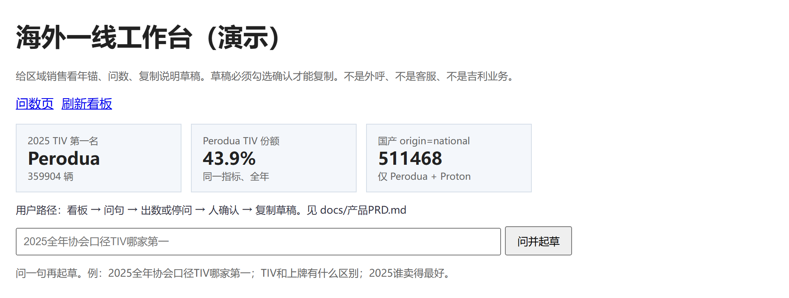
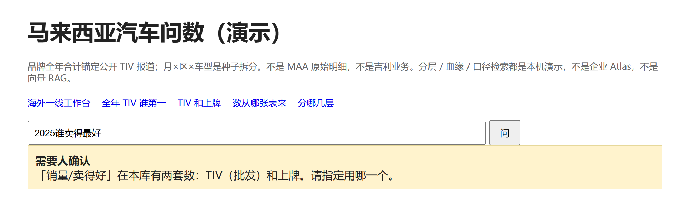

# malaysia-auto-ask

[](https://github.com/LUOaini1213/malaysia-auto-ask/actions/workflows/ci.yml)

**Ask-the-data demo for the Malaysian car market, standard library only.** A question in
natural language becomes an intent, then a whitelisted SQL template, then a table with its
metric definition, owner and table-level lineage. The one design decision that matters:
when the question does not say *which* number it wants — wholesale (TIV) or registrations,
which disagree by up to 17% in a given month — the system **stops and asks** instead of
guessing. 30 self-authored questions: 22 answered correctly, 8 stopped with a structured
reason code; with the guard switched off, all 8 are answered silently and 7 of them answer
a different question than the one asked. No API key, no third-party package, `python`
3.10+, everything below reproduces in under a minute.



仓：https://github.com/LUOaini1213/malaysia-auto-ask

马来西亚汽车市场 **问数演示**：自然语言 → 意图 → 白名单 SQL → 表。  
口径问句走 **词重叠检索**（`口径.md` + `metric_dict` + 血缘节点），不是向量 RAG。  
目的：把「问数」做成可评测的最小闭环——SQL 分层、指标口径、表级血缘、停问策略各占一层，每层都能单独验。

**不是** MAA / JPJ 官方明细，**不是**任何厂商的生产问数系统或企业数据目录。

品牌全年合计按公开报道锚定（2025 年 TIV 820,752；Perodua 359,904 等）。  
月 × 区域 × 车型是固定种子拆出来的演示数。TIV 和上牌是两列，允许对不上。

## 怎么跑

```bash
git clone https://github.com/LUOaini1213/malaysia-auto-ask && cd malaysia-auto-ask
python scripts/seed.py
python scripts/ask_cli.py "2025全年协会口径TIV哪家第一"
python scripts/ask_cli.py "2025谁卖得最好"            # 停下来问人：TIV 还是上牌？
python scripts/ask_cli.py "TIV和上牌有什么区别"
python scripts/ask_cli.py "上牌数从哪张表来"
python -m unittest discover -s tests -v              # 含数值主张重算与全部 SQL 模板的筛选组合回归
python scripts/eval.py                               # 30 题评测 -> eval/last_run.json
python scripts/ablation.py --check                   # 消融重算并与 eval/ablation.json 逐字段比对
python scripts/serve.py
# 浏览器 http://127.0.0.1:8766
# 海外一线工作台 http://127.0.0.1:8766/desk
```

无第三方包。Python 3.10+，只用标准库 sqlite3。CI（`.github/workflows/ci.yml`）在 3.10 / 3.11 / 3.12 上跑同样三条命令。



## 上牌怎么生成的（批发 ≠ 上牌）

TIV 年合计按公开报道锚定，**不动**；上牌由批发经渠道推导：

```
reg[m] = λ[m] × tiv[m] + (1 − λ[m−1]) × tiv[m−1]
```

- **λ**：当月批发中当月即上牌的比例。国产双雄产销紧咬（Perodua 0.88 / Proton 0.86）；
  Honda 零售强、库存薄（0.84）；Toyota 更依赖向经销商压批发（0.74）；
  BYD 终端走量快（0.80）；Chery 铺渠道阶段库存厚（0.64）。
- **季末压货**：3/6/9/12 月 λ 再乘 0.90，货压在渠道，次月才上牌。
- **区域**：上牌发生在终端所在州，巴生谷 1.05、东马 0.92、其余 0.98。
- **跨年**：1 月消化的是上一年 12 月压在渠道里的货。

因此年合计两套数接近（滞后基本对冲），月度背离明显——这与真实市场一致。
λ 是假设值，不是实测。

## 演示分层

| 层 | 表 | 作用 |
|----|----|------|
| ODS | `ods_brand_year_anchor` | 公开报道的品牌年 TIV 锚 |
| DIM | `dim_brand` / `dim_model` / `dim_region` | 品牌、车型、区域 |
| DWD | `fact_month` | 年-月-车型-区域：`tiv_units`、`registration_units` |
| ADS | `ads_brand_year` / `ads_brand_month` | 品牌年 / 月汇总 |
| 指标 | `metric_dict` | 口径、owner、版本 |
| 血缘 | `lineage_node` / `lineage_edge` | 表级边，可从指标走回 ODS |

全年、无区域、无能源的品牌合计走 ADS；带月 / 区域 / 能源 / 车型走 DWD。

所有 8 个 DWD 模板都支持已解析的月、区域、品牌、能源和国产/非国产筛选。
5 个 ADS 模板支持品牌和国产/非国产筛选；出现月、区域或能源条件时自动走 DWD。
各月/各区域等分组也保留显式筛选，不会为了展开分组而丢掉条件。
品牌份额的分母是同年、同月、同区域、同能源、同国产口径的全品牌市场，
品牌条件只选择分子。例如「国产车 Perodua 份额」分母为 Perodua + Proton，
不会自动变成全市场份额或 Perodua 自身的 100%。

`tests/test_filter_contract.py` 用独立逐行汇总核对全部模板和筛选组合，
并覆盖「纯电丰田总量」「纯电各月趋势」「国产纯电车型排名」等问句。

## 停问机制消融对照（`python scripts/ablation.py`）

同一批 30 题跑两次：**A 护栏开**（该停就停）、**B 护栏关**（按没有护栏的系统的朴素默认强行作答）。

| | A 护栏开 | B 护栏关 |
|---|---|---|
| 该停的停住 | **8/8** | 0/8 |
| 该答的答对 | **22/22** | 22/22（无回归） |
| 无提示猜测 | 0 | **8/8** |
| 结论被改变 | 0 | **7/8** |

护栏关掉后，8 条本该停问的题**全部返回了一张看起来正常的表**，界面上没有任何提示。
「结论被改变」的依据在 `eval/ablation.json` 每行的 `basis` 里写明：7 条是**按定义**成立——筛选被丢弃或时间被改写后，返回的表就不是被问的那张表；唯一一条双口径歧义题（第 23 题）是**实测**——两套口径都算一遍，排名结论相同，所以不计入。表里所有计数都是跑出来的，脚本里没有写死的常量；`python scripts/ablation.py --check` 会把一次新跑与提交的 JSON 逐字段比对。

### 停问原因分类（5 类 / 8 题）

| 原因码 | 中文 | n | 题号 | 关掉护栏后系统会做什么 |
|---|---|---|---|---|
| `OUT_OF_SCOPE_ENTITY` | 库外实体 | 2 | 25, 26 | 丢弃不认识的市场/品牌筛选，退回全库 |
| `UNDEFINED_TERM` | 无口径措辞 | 2 | 27, 29 | 丢弃「豪华 / 帮我看看」，退回全库 |
| `RELATIVE_TIME` | 相对时间 | 2 | 24, 28 | 把「上个月 / 今年」映射到库内最新时点 |
| `AMBIGUOUS_METRIC` | 双口径歧义 | 1 | 23 | 默认取 TIV |
| `YEAR_OUT_OF_RANGE` | 年份越界 | 1 | 30 | 把 2026 夹到 2025 |

典型：第 29 题「帮我看看马来西亚车市」在护栏关闭下**连猜三次**（丢弃无口径措辞 → 默认 2025 → 默认 TIV），然后给出一张全品牌 TIV 排名表。

### 口径翻转对照：危害在数值，不在排名

第 23 题「2025谁卖得最好」猜了 TIV，**排名结论没变**——但这不是"猜口径无所谓"，而是这个市场的排名本身对口径不敏感：

| 对照（2025） | 结果 |
|---|---|
| 全年 top1 / 完整排序变化 | 否 / 否 |
| 月度 top1 翻转 | **0 / 12** |
| 月度完整排序变化 | **0 / 12** |
| 区域 top1 翻转 | **0 / 7** |
| 品牌年合计口径差 | 0.12% ~ 2.12%（均值 0.78%） |
| **月度口径差** | **最大 17.47%**（1 月 +17.5%、12 月 −11.7%、3/6/9 月 −8~−9%） |
| 旧模型（2026-09-02 前，上牌 = 批发 × 各区固定系数）的月度口径差 | 常态 **0.32%**，仅 2025-12 因年末赶量到 4.3% |

原因：Perodua 断层领先，Honda 稳定领先 Toyota 约 2.7%，相邻品牌差距远大于口径带来的扰动。

**所以猜口径的危害在数值不在排名**——问"谁第一"猜错口径不致命，问"某月卖了多少"就会差到 17%。护栏该守的是后者。旧模型下两套数几乎逐月相等（0.32%），护栏看起来多余；换成有渠道滞后的模型后差距才显出来——这也是为什么要把上牌机制做真一点。

> λ（渠道周转率）是基于真实机制的假设值，**没有按「让排名翻转」反向调参**。`scripts/ablation.py` 的 `lambda_sensitivity` 把所有品牌的 λ 同乘 0.4 ~ 1.2 重算上牌：月度数值差从 29.4% 一路变到 10.4%，但**月度 top1 0/12、区域 top1 0/7 在整个范围内都不翻转**（`eval/ablation.json` → `lambda_sensitivity`）。也就是说排名不敏感这个结论不依赖某个特定的 λ，调参也调不出翻转。

## 口径（问不清就停）

| 指标 | 含义 |
|------|------|
| TIV / 批发 | 协会风格批发。问「销量/卖得好」且没说上牌 → **停，问人** |
| 上牌 | 演示用的注册列，和 TIV 不是同一套数 |
| 份额 | 分子分母同一指标、同一筛选 |
| 国产车 | 只 Perodua + Proton，不是「马来西亚生产的都算」 |

模型不许拼 SQL。只能填白名单模板。每次出数带口径定义、owner、version、SQL、表级血缘。  
「口径 / 从哪来 / 哪张表」不跑 SQL，返回检索片段和血缘路径。

## 海外一线工作台（`/desk`）

看板卡片 + 问数 + 「给海外同事的说明草稿」。草稿默认不能复制，勾选确认后才能复制。  
产品说明：`docs/产品PRD.md`、`docs/区域产品定义.md`。

不是智能外呼、不是客服、不是座舱 / RoboOS。

## 评测

问数 30 条（`eval/cases.json`）+ 口径检索 8 条（`eval/retrieve_cases.json`）。最近一次结果提交在 `eval/last_run.json`（`python scripts/eval.py` 重新生成；CI 每次都跑）：

| 指标 | 值 | 怎么算 |
|------|----|--------|
| 成功率 | **100%**（22/22） | 该出数的题，模板和结果对 |
| 准确率 | **100%**（22/22） | 模板 + 参数和金标一致 |
| 人工干预率 | **26.7%**（8/30） | 系统停下来问人的比例 |
| 口径检索 | **8/8** | 命中正确文档或血缘节点（词重叠） |

8 条故意停：没指定 TIV/上牌、相对时间（上个月/今年）、华南、吉利当品牌、豪华车无定义、2026 年库没有。题目和金标都是本人写的，这是自测，不是第三方评测；护栏的 7 个原因码（`malaysia_ask/intent.py` 的 `HITL_CODES`）在这 8 题里触发了 5 个。

```powershell
python scripts/eval.py
```

## 范围与边界

- 不把本库写成 MAA/JPJ 原始数，也不写成任何厂商的生产问数产品
- 不把「填模板」写成生产 NL2SQL
- 不把词重叠检索写成向量 RAG / 企业知识库
- 不把 `lineage_edge` 写成企业数仓血缘平台
- 不把 `/desk` 写成外呼或客服工具
- Proton 是国产车品牌；库里没有 Geely 品牌行

公开锚点来源：MAA 2025 TIV 820,752；Perodua / Proton / Honda / Toyota / Mazda 等品牌年为公开报道。其余拆分是演示。
